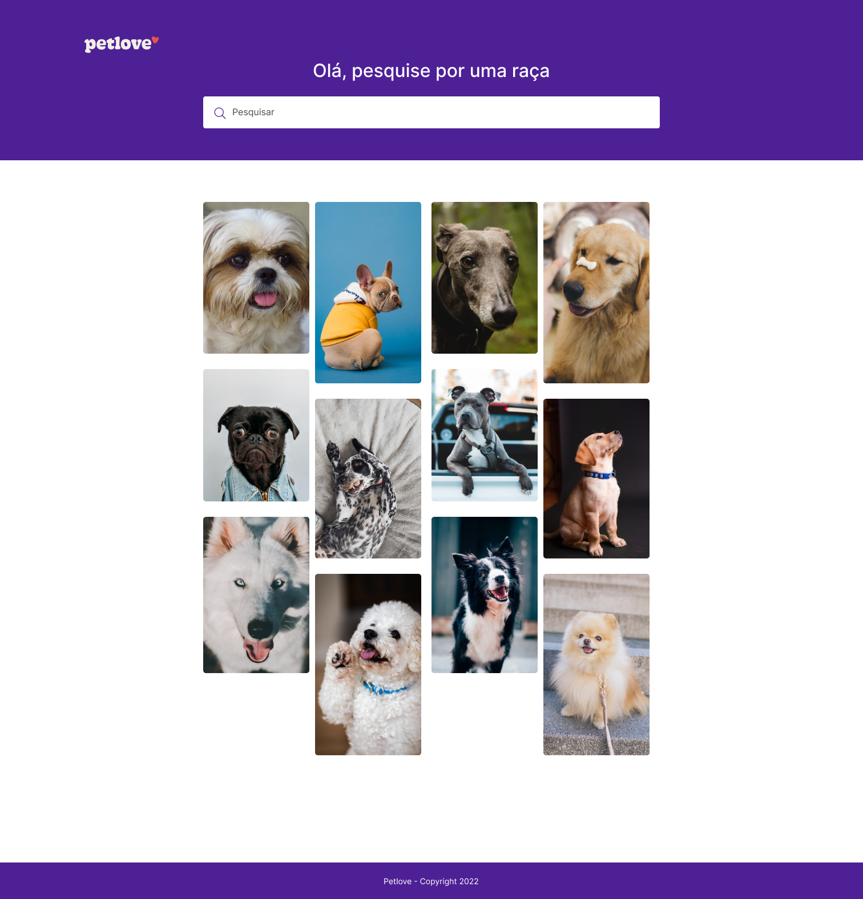

<h2 align="center">Petlove Pets</h2> 

<pre align="center">
🧪 Projeto desenvolvido para a talk sobre nuxt 3 com strapi
</pre>

## Features

- [💚 Nuxt 3](https://v3.nuxtjs.org) - SSR, ESR, File-based routing, components auto importing, modules, etc.

- ⚡️ Vite - Instant HMR

- 🎨 [Tailwind](https://tailwindcss.com/) - Rapidly build modern websites without ever leaving your HTML.

- 🔥 The `<script setup>` syntax

- 📑 [Layout system](./layouts)

- 📥 APIs auto importing - for Composition API, VueUse and custom composables.

- 🦾 TypeScript, of course

## Plugins

### Nuxt Modules

- [VueUse](https://github.com/vueuse/vueuse) - collection of useful composition APIs.

## IDE

We recommend using [VS Code](https://code.visualstudio.com/) with [Volar](https://github.com/johnsoncodehk/volar) to get the best experience (You might want to disable Vetur if you have it).
